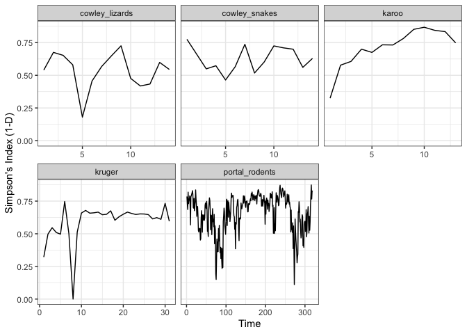
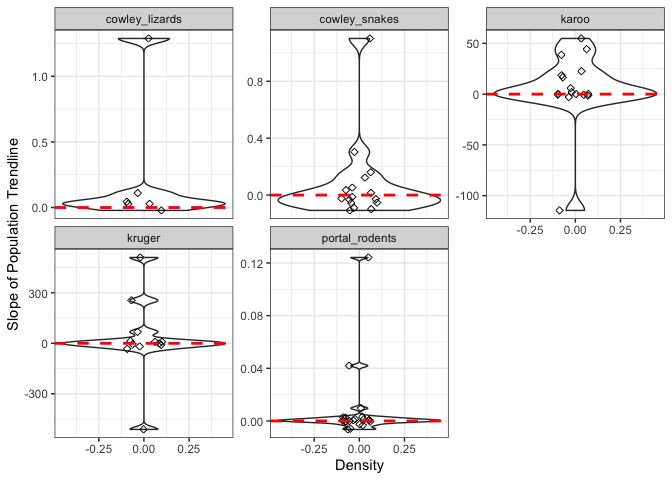

Summary Report
================
Travis CI
2020-03-27

This report was compiled and generated by the `MATSS` R package (Ye et
al. 2020).

## Read in the results

As a result of running the Drake pipeline, we have objects for each of
the “targets” in the Drake cache. First, let’s examine what the names of
those targets are:

``` r
cached()
```

    ##  [1] "analysis_linear_trend_cowley_lizards" 
    ##  [2] "analysis_linear_trend_cowley_snakes"  
    ##  [3] "analysis_linear_trend_karoo"          
    ##  [4] "analysis_linear_trend_kruger"         
    ##  [5] "analysis_linear_trend_portal_rodents" 
    ##  [6] "analysis_simpson_index_cowley_lizards"
    ##  [7] "analysis_simpson_index_cowley_snakes" 
    ##  [8] "analysis_simpson_index_karoo"         
    ##  [9] "analysis_simpson_index_kruger"        
    ## [10] "analysis_simpson_index_portal_rodents"
    ## [11] "citation_text_cowley_lizards"         
    ## [12] "citation_text_cowley_snakes"          
    ## [13] "citation_text_karoo"                  
    ## [14] "citation_text_kruger"                 
    ## [15] "citation_text_portal_rodents"         
    ## [16] "citations"                            
    ## [17] "cowley_lizards"                       
    ## [18] "cowley_snakes"                        
    ## [19] "karoo"                                
    ## [20] "kruger"                               
    ## [21] "linear_trend"                         
    ## [22] "portal_rodents"                       
    ## [23] "results_linear_trend"                 
    ## [24] "results_simpson_index"                
    ## [25] "simpson_index"

Note that we have two sets of results, one for running the
`compute_simpson_index()` function on each dataset, and one for running
the `compute_linear_trend()` function on each dataset (producing results
for each time series in each dataset).

We can use `loadd()` to load specific targets (or all of them) into the
R environment; similar to the base `load()` function for loading in
.Rdata files.

Alternatively, we can use `readd()` to return a target directly; similar
to the base `readRDS()` function for reading in .RDS files.

### Simpson’s Index

First, let’s look at the `compute_simpson_index()` results:

``` r
results_simpson_index <- readd("results_simpson_index")
results_simpson_index
```

    ## # A tibble: 5 x 5
    ##   results     metadata         dataset        method        args      
    ##   <list>      <list>           <chr>          <chr>         <list>    
    ## 1 <dbl [14]>  <named list [6]> cowley_lizards simpson_index <list [0]>
    ## 2 <dbl [14]>  <named list [6]> cowley_snakes  simpson_index <list [0]>
    ## 3 <dbl [13]>  <named list [6]> karoo          simpson_index <list [0]>
    ## 4 <dbl [31]>  <named list [6]> kruger         simpson_index <list [0]>
    ## 5 <dbl [319]> <named list [6]> portal_rodents simpson_index <list [0]>

The object is a tibble with the output of the calculations stored in the
`results` column: \* Because the output of `compute_simpson_index()` is
a numeric vector corresponding to Simpson’s index, computed at each time
step, these vectors are the elements of the `results` list-column. \*
Related information about the dataset and additional args are stored in
the other columns of this tibble.

### Linear Trends

Now, let’s look at the `compute_linear_trend()` results:

``` r
results_linear_trend <- readd("results_linear_trend")
results_linear_trend
```

    ## # A tibble: 5 x 5
    ##   results           metadata         dataset        method       args      
    ##   <list>            <list>           <chr>          <chr>        <list>    
    ## 1 <tibble [6 × 3]>  <named list [6]> cowley_lizards linear_trend <list [0]>
    ## 2 <tibble [16 × 3]> <named list [6]> cowley_snakes  linear_trend <list [0]>
    ## 3 <tibble [16 × 3]> <named list [6]> karoo          linear_trend <list [0]>
    ## 4 <tibble [12 × 3]> <named list [6]> kruger         linear_trend <list [0]>
    ## 5 <tibble [21 × 3]> <named list [6]> portal_rodents linear_trend <list [0]>

Again, the object is a tibble with a similar structure as previously,
with the `results` list-column containing the tibble outputs from
`compute_linear_trend`.

## Processing Results

We encourage the use of [`Tidyverse`](https://www.tidyverse.org/) for
extracting and handling the output. In particular, there are some useful
examples of dealing with complex output structures in list-columns
described in <https://github.com/jennybc/row-oriented-workflows>.

### Plot time series of Simpson’s Index

Our goal is to plot a time series of Simpson’s Index for each separate
dataset.

This suggests the following processing procedure: \* extract the values
for each dataset, to make a single long-format data.frame \* construct a
“time” variable, which will serve as the x-axis in plotting

``` r
to_plot <- results_simpson_index %>%
    select(dataset, results) %>%
    unnest(cols = results) %>%
    rename(value = results) %>%
    group_by(dataset) %>%
    mutate(t = row_number()) %>%
    ungroup()
```

Plotting is mostly straightforward. Note that we allow the x-axis scale
to vary for each dataset separately, because the number of time points
varies across datasets, and having them all be aligned across facets
would give the (false) impression of synchronicity.

``` r
ggplot(to_plot, 
       aes(x = t, y = value)) + 
    geom_line() + 
    facet_wrap(~dataset, scales = "free_x") + 
    theme_bw() + 
    labs(x = "Time", y = "Simpson's Index (1-D)")
```

<!-- -->

### Plot distribution of species trends

Our goal is to plot the distribution of species trends over time in each
dataset.

Processing is a bit simpler, since we really only need to subset the
results that we want:

``` r
to_plot <- results_linear_trend %>%
    select(dataset, results) %>%
    unnest(cols = results) %>%
    select(dataset, id, t)
```

When plotting, we note that the range in slopes varies a lot, and
depends on abundance scaling, so we allow the facets to have different
y-axis scales, making sure to add in the 0 line, and jittering the
points for the raw data, too.

``` r
ggplot(to_plot, 
       aes(x = 0, y = t)) + 
    geom_violin() + 
    geom_point(position = position_jitter(width = 0.1, height = 0), shape = 5) + 
    geom_hline(mapping = aes(yintercept = 0), size = 1, lty = 2, color = "red") + 
    facet_wrap(~dataset, scales = "free_y") + 
    theme_bw() + 
    labs(x = "Density", y = "Slope of Population Trendline")
```

<!-- -->

## Dataset Citations

1.  Wilgers, DJ, Horne, EA, Sandercock, BK, Volkmann, AW, 2006. EFFECTS
    OF RANGELAND MANAGEMENT ON COMMUNITY DYNAMICS OF THE HERPETOFAUNA OF
    THE TALLGRASS PRAIRIE, Herpetologica, 62(4).
2.  SANParks (2009) Karoo National Park Census Data. 1994 - 2009 (South
    African National Park Data Repository: peggym.117.10)
3.  SANParks (1997) Census totals for large herbivores in the Kruger
    National Park summarized by year and region 1965-1997 (South African
    National Park Data Repository: judithk.814.4)
4.  S. K. Morgan Ernest, Glenda M. Yenni, Ginger Allington, Ellen K.
    Bledsoe, Erica M. Christensen, Renata M. Diaz, Keith Geluso, Jacob
    R. Goheen, Qinfeng Guo, Edward Heske, Douglas Kelt, Joan M. Meiners,
    Jim Munger, Carla Restrepo, Douglas A. Samson, Michele R.
    Schutzenhofer, Marian Skupski, Sarah R. Supp, Kate Thibault, Shawn
    Taylor, Ethan White, Diane W. Davidson, James H. Brown, and Thomas
    J. Valone. (2018). The Portal Project: a long-term study of a
    Chihuahuan desert ecosystem. bioRxiv,
    <https://doi.org/10.1101/332783>

## References

<div id="refs" class="references">

<div id="ref-ye2020MATSS">

Ye, Hao, Ellen K. Bledsoe, Renata Diaz, S. K. Morgan Ernest, Juniper L.
Simonis, Ethan P. White, and Glenda M. Yenni. 2020. “Macroecological
Analyses of Time Series Structure.” Zenodo.
<https://doi.org/10.5281/zenodo.3643617>.

</div>

</div>
